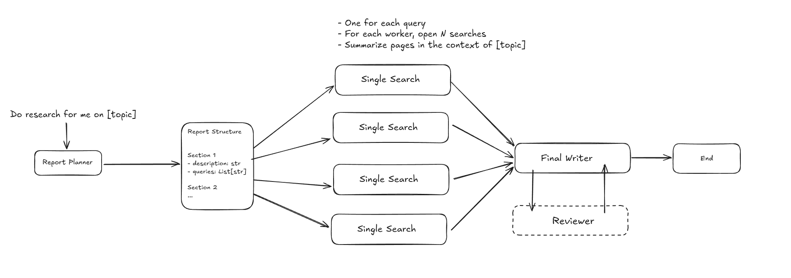
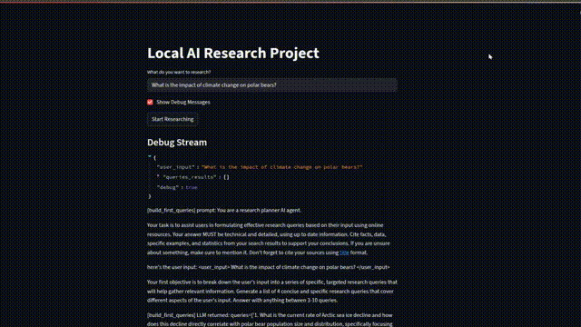

# local-ai-research
A professional AI research assistant, similar to Perplexity AI, powered by LangGraph and local LLMs. Designed for advanced question answering, reasoning, and knowledge retrieval, it operates fully offline to ensure privacy and complete control over data.

  

  

